# Polyglot Codebase Knowledge Graph

> Generated offline by **readmenator**. Supports C, C++, Python, Go, Rust, JS/TS, Java, C#, Shell, PHP, Dart, GDScript, Nim, ASM, Ruby, Swift, Kotlin, Scala, Lua, Elixir.
> No LLMs. No tokens. Pure static analysis. See more [here](https://github.com/grisuno/ReadMenator)

**Total Files Parsed:** 10 | **Total Symbols Extracted:** 41 | **Total Imports:** 34
 | **Resolved Imports:** 7

<!-- ranking_model: v1.0 | weights: {ppr:0.45,auth:0.2,test:0.15,doc:0.1,fresh:0.1} | alpha:0.85 | commit:75d209c | date:2026-07-18 -->


## Table of Contents

1. [Statistics Dashboard](#statistics-dashboard)
2. [Architectural Layers](#architectural-layers)
3. [Ranked Context](#ranked-context)
4. [God Nodes](#god-nodes)
5. [Community Analysis](#community-analysis)
6. [Surprising Connections](#surprising-connections)
7. [Suggested Questions](#suggested-questions)
8. [Hotspot Analysis](#hotspot-analysis)
9. [Change Impact Analysis](#change-impact-analysis)
10. [Suggested Linting Rules](#suggested-linting-rules)
11. [Orphans](#orphans)
12. [Query Recipes](#query-recipes)
13. [Structural Knowledge Map](#structural-knowledge-map)
14. [UML Class Diagram](#uml-class-diagram)
15. [Code Property Graph](#code-property-graph)
16. [Architecture Reference](#architecture-reference)
    - [PY (9 files)](#py-9-files)
    - [SH (1 files)](#sh-1-files)

---

## Statistics Dashboard

| Metric | Value |
|--------|-------|
| Total Files | 10 |
| Total Symbols | 41 |
| Total Imports | 34 |
| Call Edges | 134 |
| Inheritance Edges | 7 |
| Languages | 2 |
| Avg Symbols/File | 4.1 |
| Avg Imports/File | 3.4 |
| Resolved Imports | 7 |

### Top Files by Import Count (Fan-Out)

| File | Imports | Symbols | Language |
|------|---------|---------|----------|
| `orquestador.py` | 11 | 1 | py |
| `etl.py` | 9 | 18 | py |
| `app_unit_test.py` | 5 | 5 | py |
| `data_loader_unit_test.py` | 3 | 4 | py |
| `orquestador_unit_test.py` | 3 | 2 | py |
| `etl_unit_test.py` | 2 | 7 | py |
| `data_navigation.py` | 1 | 4 | py |

---

## Architectural Layers

Auto-detected from path patterns, naming conventions, and imported frameworks.

| Layer | Files |
|-------|-------|
| utility | 4 |
| testing | 4 |
| data_access | 2 |

### utility

- `app.py` (py, 0 symbols)
- `etl.py` (py, 18 symbols)
- `install.sh` (sh, 0 symbols)
- `orquestador.py` (py, 1 symbols)

### testing

- `app_unit_test.py` (py, 5 symbols)
- `data_loader_unit_test.py` (py, 4 symbols)
- `etl_unit_test.py` (py, 7 symbols)
- `orquestador_unit_test.py` (py, 2 symbols)

### data_access

- `data_loader.py` (py, 0 symbols)
- `data_navigation.py` (py, 4 symbols)

---

## Ranked Context

Files ranked by composite score for the current query context. The ranking combines Personalized PageRank (query relevance), global authority, test coverage, documentation coverage, and code freshness. Model: v1.0.

| Rank | File | Composite | PPR | Authority | Test | Doc |
|------|------|-----------|-----|-----------|------|-----|
| 1 | `data_navigation.py` | 0.1366 | 0.2101 | 0.2101 | 0.00 | 0.00 |
| 2 | `data_loader.py` | 0.1150 | 0.1769 | 0.1769 | 0.00 | 0.00 |
| 3 | `app.py` | 0.0896 | 0.1379 | 0.1379 | 0.00 | 0.00 |
| 4 | `orquestador.py` | 0.0896 | 0.1379 | 0.1379 | 0.00 | 0.00 |
| 5 | `etl.py` | 0.0738 | 0.1136 | 0.1136 | 0.00 | 0.00 |
| 6 | `app_unit_test.py` | 0.0484 | 0.0745 | 0.0745 | 0.00 | 0.00 |
| 7 | `data_loader_unit_test.py` | 0.0484 | 0.0745 | 0.0745 | 0.00 | 0.00 |
| 8 | `orquestador_unit_test.py` | 0.0484 | 0.0745 | 0.0745 | 0.00 | 0.00 |
| 9 | `etl_unit_test.py` | 0.0000 | 0.0000 | 0.0000 | 0.00 | 0.00 |
| 10 | `install.sh` | 0.0000 | 0.0000 | 0.0000 | 0.00 | 0.00 |

---

## God Nodes

Most architecturally central files ranked by combined import/export degree and symbol richness.

| File | Score | Connections | PageRank |
|------|-------|-------------|----------|
| `orquestador.py` | 8.1 | | 0.1379 |
| `etl.py` | 5.8 | | 0.1136 |
| `data_navigation.py` | 4.4 | | 0.2101 |
| `data_loader.py` | 4.0 | | 0.1769 |
| `app_unit_test.py` | 2.5 | | 0.0745 |
| `data_loader_unit_test.py` | 2.4 | | 0.0745 |
| `orquestador_unit_test.py` | 2.2 | | 0.0745 |
| `app.py` | 2.0 | | 0.1379 |
| `etl_unit_test.py` | 0.7 | | 0.0000 |
| `install.sh` | 0.0 | | 0.0000 |

---

## Community Analysis

Files grouped by import-based community detection. Cohesion measures how tightly connected each community is internally.

### root (Cohesion: 1.00)

**2 files** in this community:

- `app.py` (py, 0 symbols)
- `app_unit_test.py` (py, 5 symbols)

### root (Cohesion: 0.50)

**2 files** in this community:

- `data_loader.py` (py, 0 symbols)
- `data_loader_unit_test.py` (py, 4 symbols)

### root (Cohesion: 0.80)

**4 files** in this community:

- `data_navigation.py` (py, 4 symbols)
- `etl.py` (py, 18 symbols)
- `orquestador.py` (py, 1 symbols)
- `orquestador_unit_test.py` (py, 2 symbols)

---

## Surprising Connections

Files in different communities connected through 3+ indirect hops.

- `data_loader_unit_test.py` <-> `data_navigation.py` (3 hops, across 2 communities)
- `data_loader_unit_test.py` <-> `etl.py` (3 hops, across 2 communities)
- `data_loader_unit_test.py` <-> `orquestador_unit_test.py` (3 hops, across 2 communities)

---

## Suggested Questions

Auto-generated exploration prompts based on graph structure:

- What does orquestador.py depend on, and what depends on it? (4 connections)
- What does etl.py depend on, and what depends on it? (2 connections)
- What does data_navigation.py depend on, and what depends on it? (2 connections)
- How are the 4 files in 'root' related to each other?
- Why are data_loader_unit_test.py and data_navigation.py connected through 3 hops across 2 communities?

---

## Hotspot Analysis

Files ranked by combined complexity (symbol count) and centrality (connection count). High-scoring files are architecturally critical and may need refactoring attention.

| File | Complexity | Centrality | Combined | Symbols | Connections |
|------|-----------|------------|----------|---------|-------------|
| `data_navigation.py` | 0.222 | 0.200 | 0.209 | 4 | 3 |
| `data_loader.py` | 0.000 | 0.133 | 0.080 | 0 | 2 |
| `app.py` | 0.000 | 0.067 | 0.040 | 0 | 1 |
| `orquestador.py` | 0.056 | 1.000 | 0.622 | 1 | 15 |
| `etl.py` | 1.000 | 0.733 | 0.840 | 18 | 11 |
| `app_unit_test.py` | 0.278 | 0.400 | 0.351 | 5 | 6 |
| `data_loader_unit_test.py` | 0.222 | 0.267 | 0.249 | 4 | 4 |
| `orquestador_unit_test.py` | 0.111 | 0.267 | 0.204 | 2 | 4 |
| `etl_unit_test.py` | 0.389 | 0.133 | 0.236 | 7 | 2 |
| `install.sh` | 0.000 | 0.000 | 0.000 | 0 | 0 |

---

## Change Impact Analysis

Files sorted by how many other files would be affected if they changed. High-impact files should be changed with caution.

| File | Direct Dependents | Transitive Dependents | Total Impact |
|------|------------------|----------------------|--------------|
| `data_loader.py` | 2 | 1 | 3 |
| `data_navigation.py` | 2 | 1 | 3 |
| `etl.py` | 1 | 1 | 2 |
| `app.py` | 1 | 0 | 1 |
| `orquestador.py` | 1 | 0 | 1 |
| `app_unit_test.py` | 0 | 0 | 0 |
| `data_loader_unit_test.py` | 0 | 0 | 0 |
| `etl_unit_test.py` | 0 | 0 | 0 |
| `install.sh` | 0 | 0 | 0 |
| `orquestador_unit_test.py` | 0 | 0 | 0 |

---

## Suggested Linting Rules

Automatically suggested linting and security rules based on patterns detected in the codebase. These can be exported as Semgrep rules using the `--export-rules` flag.

| Rule ID | Severity | Description | Language | Matches |
|---------|----------|-------------|----------|---------|
| `RM001` | info | Large number of functions in py: 29 total | py | 29 |
| `RM002` | info | Print statement found (consider logging instead) | python | 9 |

---

## Orphans

Files with no documentation or low connectivity. These are candidates for documentation investment or cleanup.

- `data_navigation.py` (4 symbols, no doc)
- `data_loader.py` (0 symbols, no doc)
- `app.py` (0 symbols, no doc)
- `orquestador.py` (1 symbols, no doc)
- `etl.py` (18 symbols, no doc)
- `app_unit_test.py` (5 symbols, no doc)
- `data_loader_unit_test.py` (4 symbols, no doc)
- `orquestador_unit_test.py` (2 symbols, no doc)
- `etl_unit_test.py` (7 symbols, no doc)
- `install.sh` (0 symbols, no doc)

---

## Query Recipes

Example queries you can run against this knowledge base using the ranking engine:

```
# Find files most relevant to a concept
readmenator query "Where is the import resolver implemented?"

# Rank files by relevance to a topic
readmenator query "How does documentation generation work?"

# Explain why a file ranks highly
readmenator query "explain readmenator/_documentation.py"

# Trace dependency paths with ranked context
readmenator query "path from CLI to exporter"
```

The ranking model uses the following signals:

- **Personalized PageRank** (45% weight): query-specific relevance via seed propagation
- **Global Authority** (20% weight): structural importance via standard PageRank
- **Test Coverage** (15% weight): fraction of symbols referenced in test files
- **Doc Coverage** (10% weight): presence of docstrings and file-level docs
- **Freshness** (10% weight): recent modification activity

Results include score decomposition and justification paths for each ranked item.

---

## Structural Knowledge Map

```mermaid
graph TD
    classDef mod fill:#1e1e1e,stroke:#ff6666,stroke-width:2px,color:#fff;
    classDef cls fill:#2d2d2d,stroke:#4ec9b0,stroke-width:2px,color:#fff;
    classDef fn fill:#333,stroke:#dcdcaa,stroke-width:1px,color:#dcdcaa;
    classDef ext fill:#111,stroke:#666,stroke-dasharray:5 5,color:#aaa;
    subgraph community_2 ["root"]
    orquestador_py["orquestador.py (py)"]
    class orquestador_py mod;
    orquestador_py_main["main"]
    class orquestador_py_main fn;
    orquestador_py --> orquestador_py_main
    etl_py["etl.py (py)"]
    class etl_py mod;
    etl_py_Config["Config"]
    class etl_py_Config cls;
    etl_py --> etl_py_Config
    etl_py_Transformer["Transformer"]
    class etl_py_Transformer cls;
    etl_py --> etl_py_Transformer
    etl_py_DataQualityChecker["DataQualityChecker"]
    class etl_py_DataQualityChecker cls;
    etl_py --> etl_py_DataQualityChecker
    etl_py_ETLHandler["ETLHandler"]
    class etl_py_ETLHandler cls;
    etl_py --> etl_py_ETLHandler
    etl_py_ETLProcessor["ETLProcessor"]
    class etl_py_ETLProcessor cls;
    etl_py --> etl_py_ETLProcessor
    end
    subgraph community_0 ["root"]
    app_unit_test_py["app_unit_test.py (py)"]
    class app_unit_test_py mod;
    end
    subgraph community_1 ["root"]
    data_loader_unit_test_py["data_loader_unit_test.py (py)"]
    class data_loader_unit_test_py mod;
    orquestador_unit_test_py["orquestador_unit_test.py (py)"]
    class orquestador_unit_test_py mod;
    etl_unit_test_py["etl_unit_test.py (py)"]
    class etl_unit_test_py mod;
    data_navigation_py["data_navigation.py (py)"]
    class data_navigation_py mod;
    app_py["app.py (py)"]
    class app_py mod;
    data_loader_py["data_loader.py (py)"]
    class data_loader_py mod;
    install_sh["install.sh (sh)"]
    class install_sh mod;
    end
    app_unit_test_py -- resolved_imports --> app_py
    data_loader_unit_test_py -- resolved_imports --> data_loader_py
    etl_py -- resolved_imports --> data_navigation_py
    orquestador_py -- resolved_imports --> data_navigation_py
    orquestador_py -- resolved_imports --> etl_py
    orquestador_py -- resolved_imports --> data_loader_py
    orquestador_unit_test_py -- resolved_imports --> orquestador_py
    ext_unittest["unittest"]
    class ext_unittest ext;
    app_unit_test_py -.->|imports| ext_unittest
    ext_unittest_mock["unittest.mock"]
    class ext_unittest_mock ext;
    app_unit_test_py -.->|imports| ext_unittest_mock
    ext_flask["flask"]
    class ext_flask ext;
    app_unit_test_py -.->|imports| ext_flask
    ext_flask_login["flask_login"]
    class ext_flask_login ext;
    app_unit_test_py -.->|imports| ext_flask_login
    ext_app["app"]
    class ext_app ext;
    app_unit_test_py -.->|imports| ext_app
    data_loader_unit_test_py -.->|imports| ext_unittest
    data_loader_unit_test_py -.->|imports| ext_unittest_mock
    ext_data_loader["data_loader"]
    class ext_data_loader ext;
    data_loader_unit_test_py -.->|imports| ext_data_loader
    ext_pymongo["pymongo"]
    class ext_pymongo ext;
    data_navigation_py -.->|imports| ext_pymongo
    ext_os["os"]
    class ext_os ext;
    etl_py -.->|imports| ext_os
    ext_yaml["yaml"]
    class ext_yaml ext;
    etl_py -.->|imports| ext_yaml
    ext_pandas["pandas"]
    class ext_pandas ext;
    etl_py -.->|imports| ext_pandas
    etl_py -.->|imports| ext_pymongo
    ext_logging["logging"]
    class ext_logging ext;
    etl_py -.->|imports| ext_logging
    ext_watchdog_observers["watchdog.observers"]
    class ext_watchdog_observers ext;
    etl_py -.->|imports| ext_watchdog_observers
    ext_watchdog_events["watchdog.events"]
    class ext_watchdog_events ext;
    etl_py -.->|imports| ext_watchdog_events
    ext_datetime["datetime"]
    class ext_datetime ext;
    etl_py -.->|imports| ext_datetime
    ext_data_navigation["data_navigation"]
    class ext_data_navigation ext;
    etl_py -.->|imports| ext_data_navigation
    etl_unit_test_py -.->|imports| ext_unittest
    ext_your_etl_script["your_etl_script"]
    class ext_your_etl_script ext;
    etl_unit_test_py -.->|imports| ext_your_etl_script
    orquestador_py -.->|imports| ext_os
    orquestador_py -.->|imports| ext_yaml
    orquestador_py -.->|imports| ext_pandas
    ext_paramiko["paramiko"]
    class ext_paramiko ext;
    orquestador_py -.->|imports| ext_paramiko
    ext_pymysql["pymysql"]
    class ext_pymysql ext;
    orquestador_py -.->|imports| ext_pymysql
    orquestador_py -.->|imports| ext_logging
    ext_ftplib["ftplib"]
    class ext_ftplib ext;
    orquestador_py -.->|imports| ext_ftplib
    orquestador_py -.->|imports| ext_datetime
    orquestador_py -.->|imports| ext_data_navigation
    ext_etl["etl"]
    class ext_etl ext;
    orquestador_py -.->|imports| ext_etl
    orquestador_py -.->|imports| ext_data_loader
    orquestador_unit_test_py -.->|imports| ext_unittest
    orquestador_unit_test_py -.->|imports| ext_unittest_mock
    ext_orquestador["orquestador"]
    class ext_orquestador ext;
    orquestador_unit_test_py -.->|imports| ext_orquestador
```



---

## UML Class Diagram

Auto-generated Mermaid class diagram from parsed class-level symbols. Shows classes, structs, interfaces, traits, and their methods with inheritance and dependency relationships.

```mermaid
classDiagram
  class app_unit_test_py_TestApp {
    <<class>>
    +test_index(self, mock_render_template)
    +test_create_config(self, mock_db, mock_User, mock_UserController, mock_url_for, mock_redirect)
    +test_start_etl(self, mock_data_navigator, mock_ETLProcessor, mock_DataQualityChecker, mock_Transformer, mock_Config, mock_ETLController, mock_url_for, mock_redirect, mock_flash)
    +test_etl_status(self, mock_current_user, mock_ProcessController, mock_render_template)
  }
  class data_loader_unit_test_py_TestSourceLoader {
    <<class>>
    +setUp(self)
    +test_load_ftp(self, mock_print)
    +test_load_mysql(self)
  }
  class data_navigation_py_DataNavigator {
    <<class>>
    +__init__(self, db_name, collection_name)
    +find_by_dataset_tablename_date(self, dataset, tablename, date)
    +find_by_query(self, query)
  }
  class etl_py_Config {
    <<class>>
    +__init__(self, config_path)
    +load(self, config_path)
    +get(self, key)
    +__init__(self, transformation_script)
    +apply(self, df)
    +__init__(self, qa_script)
    +check(self, df)
    +__init__(self, config, transformer, quality_checker, collection, data_navigator)
    +on_created(self, event)
    +__init__(self, config, transformer, quality_checker, data_navigator)
  }
  class etl_py_Transformer {
    <<class>>
    +__init__(self, config_path)
    +load(self, config_path)
    +get(self, key)
    +__init__(self, transformation_script)
    +apply(self, df)
    +__init__(self, qa_script)
    +check(self, df)
    +__init__(self, config, transformer, quality_checker, collection, data_navigator)
    +on_created(self, event)
    +__init__(self, config, transformer, quality_checker, data_navigator)
  }
  class etl_py_DataQualityChecker {
    <<class>>
    +__init__(self, config_path)
    +load(self, config_path)
    +get(self, key)
    +__init__(self, transformation_script)
    +apply(self, df)
    +__init__(self, qa_script)
    +check(self, df)
    +__init__(self, config, transformer, quality_checker, collection, data_navigator)
    +on_created(self, event)
    +__init__(self, config, transformer, quality_checker, data_navigator)
  }
  class etl_py_ETLHandler {
    <<class>>
    +__init__(self, config_path)
    +load(self, config_path)
    +get(self, key)
    +__init__(self, transformation_script)
    +apply(self, df)
    +__init__(self, qa_script)
    +check(self, df)
    +__init__(self, config, transformer, quality_checker, collection, data_navigator)
    +on_created(self, event)
    +__init__(self, config, transformer, quality_checker, data_navigator)
  }
  class etl_py_ETLProcessor {
    <<class>>
    +__init__(self, config_path)
    +load(self, config_path)
    +get(self, key)
    +__init__(self, transformation_script)
    +apply(self, df)
    +__init__(self, qa_script)
    +check(self, df)
    +__init__(self, config, transformer, quality_checker, collection, data_navigator)
    +on_created(self, event)
    +__init__(self, config, transformer, quality_checker, data_navigator)
  }
  class etl_py_ETLTests {
    <<class>>
    +__init__(self, config_path)
    +load(self, config_path)
    +get(self, key)
    +__init__(self, transformation_script)
    +apply(self, df)
    +__init__(self, qa_script)
    +check(self, df)
    +__init__(self, config, transformer, quality_checker, collection, data_navigator)
    +on_created(self, event)
    +__init__(self, config, transformer, quality_checker, data_navigator)
  }
  class etl_unit_test_py_TestETL {
    <<class>>
    +setUp(self)
    +test_transformation(self)
    +test_quality_check(self)
    +setUp(self)
    +test_etl_process(self)
  }
  class etl_unit_test_py_TestETLProcessor {
    <<class>>
    +setUp(self)
    +test_transformation(self)
    +test_quality_check(self)
    +setUp(self)
    +test_etl_process(self)
  }
  class orquestador_unit_test_py_TestScript {
    <<class>>
    +test_main(self, mock_open, mock_print)
  }
```



---

## Code Property Graph

Machine-readable Code Property Graph (CPG) in JSON-LD format. This block allows AI agents to parse the full structural graph without additional file reads. Compatible with GraphRAG pipelines.

```json
{"@context": "https://schema.org", "analysis": {"communities": [{"cohesion": 1.0, "id": 0, "label": "root", "size": 2}, {"cohesion": 0.5, "id": 1, "label": "root", "size": 2}, {"cohesion": 0.8, "id": 2, "label": "root", "size": 4}], "god_nodes": [{"node_id": "orquestador.py", "score": 8.1}, {"node_id": "etl.py", "score": 5.8}, {"node_id": "data_navigation.py", "score": 4.4}, {"node_id": "data_loader.py", "score": 4.0}, {"node_id": "app_unit_test.py", "score": 2.5}, {"node_id": "data_loader_unit_test.py", "score": 2.4}, {"node_id": "orquestador_unit_test.py", "score": 2.2}, {"node_id": "app.py", "score": 2.0}, {"node_id": "etl_unit_test.py", "score": 0.7}, {"node_id": "install.sh", "score": 0.0}], "surprising_connections": [{"hops": 3, "source": "data_loader_unit_test.py", "target": "data_navigation.py"}, {"hops": 3, "source": "data_loader_unit_test.py", "target": "etl.py"}, {"hops": 3, "source": "data_loader_unit_test.py", "target": "orquestador_unit_test.py"}]}, "edges": [{"confidence": "EXTRACTED", "relation": "imports", "source": "app_unit_test.py", "target": "unittest"}, {"confidence": "EXTRACTED", "relation": "imports", "source": "app_unit_test.py", "target": "unittest.mock"}, {"confidence": "EXTRACTED", "relation": "imports", "source": "app_unit_test.py", "target": "flask"}, {"confidence": "EXTRACTED", "relation": "imports", "source": "app_unit_test.py", "target": "flask_login"}, {"confidence": "EXTRACTED", "relation": "imports", "source": "app_unit_test.py", "target": "app"}, {"confidence": "EXTRACTED", "relation": "imports", "source": "data_loader_unit_test.py", "target": "unittest"}, {"confidence": "EXTRACTED", "relation": "imports", "source": "data_loader_unit_test.py", "target": "unittest.mock"}, {"confidence": "EXTRACTED", "relation": "imports", "source": "data_loader_unit_test.py", "target": "data_loader"}, {"confidence": "EXTRACTED", "relation": "imports", "source": "data_navigation.py", "target": "pymongo"}, {"confidence": "EXTRACTED", "relation": "imports", "source": "etl.py", "target": "os"}, {"confidence": "EXTRACTED", "relation": "imports", "source": "etl.py", "target": "yaml"}, {"confidence": "EXTRACTED", "relation": "imports", "source": "etl.py", "target": "pandas"}, {"confidence": "EXTRACTED", "relation": "imports", "source": "etl.py", "target": "pymongo"}, {"confidence": "EXTRACTED", "relation": "imports", "source": "etl.py", "target": "logging"}, {"confidence": "EXTRACTED", "relation": "imports", "source": "etl.py", "target": "watchdog.observers"}, {"confidence": "EXTRACTED", "relation": "imports", "source": "etl.py", "target": "watchdog.events"}, {"confidence": "EXTRACTED", "relation": "imports", "source": "etl.py", "target": "datetime"}, {"confidence": "EXTRACTED", "relation": "imports", "source": "etl.py", "target": "data_navigation"}, {"confidence": "EXTRACTED", "relation": "imports", "source": "etl_unit_test.py", "target": "unittest"}, {"confidence": "EXTRACTED", "relation": "imports", "source": "etl_unit_test.py", "target": "your_etl_script"}, {"confidence": "EXTRACTED", "relation": "imports", "source": "orquestador.py", "target": "os"}, {"confidence": "EXTRACTED", "relation": "imports", "source": "orquestador.py", "target": "yaml"}, {"confidence": "EXTRACTED", "relation": "imports", "source": "orquestador.py", "target": "pandas"}, {"confidence": "EXTRACTED", "relation": "imports", "source": "orquestador.py", "target": "paramiko"}, {"confidence": "EXTRACTED", "relation": "imports", "source": "orquestador.py", "target": "pymysql"}, {"confidence": "EXTRACTED", "relation": "imports", "source": "orquestador.py", "target": "logging"}, {"confidence": "EXTRACTED", "relation": "imports", "source": "orquestador.py", "target": "ftplib"}, {"confidence": "EXTRACTED", "relation": "imports", "source": "orquestador.py", "target": "datetime"}, {"confidence": "EXTRACTED", "relation": "imports", "source": "orquestador.py", "target": "data_navigation"}, {"confidence": "EXTRACTED", "relation": "imports", "source": "orquestador.py", "target": "etl"}, {"confidence": "EXTRACTED", "relation": "imports", "source": "orquestador.py", "target": "data_loader"}, {"confidence": "EXTRACTED", "relation": "imports", "source": "orquestador_unit_test.py", "target": "unittest"}, {"confidence": "EXTRACTED", "relation": "imports", "source": "orquestador_unit_test.py", "target": "unittest.mock"}, {"confidence": "EXTRACTED", "relation": "imports", "source": "orquestador_unit_test.py", "target": "orquestador"}, {"confidence": "EXTRACTED", "relation": "resolved_imports", "source": "app_unit_test.py", "target": "app.py"}, {"confidence": "EXTRACTED", "relation": "resolved_imports", "source": "data_loader_unit_test.py", "target": "data_loader.py"}, {"confidence": "EXTRACTED", "relation": "resolved_imports", "source": "etl.py", "target": "data_navigation.py"}, {"confidence": "EXTRACTED", "relation": "resolved_imports", "source": "orquestador.py", "target": "data_navigation.py"}, {"confidence": "EXTRACTED", "relation": "resolved_imports", "source": "orquestador.py", "target": "etl.py"}, {"confidence": "EXTRACTED", "relation": "resolved_imports", "source": "orquestador.py", "target": "data_loader.py"}, {"confidence": "EXTRACTED", "relation": "resolved_imports", "source": "orquestador_unit_test.py", "target": "orquestador.py"}], "generator": "readmenator", "metadata": {"edge_count": 182, "file_count": 10, "language_count": 2, "symbol_count": 41}, "nodes": [{"id": "app.py", "kind": "module", "label": "app.py", "language": "py", "sha256": "57b21bdb023585b8", "symbol_count": 0, "symbols": []}, {"id": "app_unit_test.py", "kind": "module", "label": "app_unit_test.py", "language": "py", "sha256": "a53b2e8352768a02", "symbol_count": 5, "symbols": [{"kind": "class", "line": 7, "name": "TestApp", "signature": "class TestApp(TestCase)"}, {"kind": "method", "line": 9, "name": "test_index", "signature": "def test_index(self, mock_render_template)"}, {"kind": "method", "line": 23, "name": "test_create_config", "signature": "def test_create_config(self, mock_db, mock_User, mock_UserController, mock_url_for, mock_redirect)"}, {"kind": "method", "line": 40, "name": "test_start_etl", "signature": "def test_start_etl(self, mock_data_navigator, mock_ETLProcessor, mock_DataQualityChecker, mock_Transformer, mock_Config, mock_ETLController, mock_url_for, mock_redirect, mock_flash)"}, {"kind": "method", "line": 52, "name": "test_etl_status", "signature": "def test_etl_status(self, mock_current_user, mock_ProcessController, mock_render_template)"}]}, {"id": "data_loader.py", "kind": "module", "label": "data_loader.py", "language": "py", "sha256": "198920a9d8443560", "symbol_count": 0, "symbols": []}, {"id": "data_loader_unit_test.py", "kind": "module", "label": "data_loader_unit_test.py", "language": "py", "sha256": "938b49febd73d1fa", "symbol_count": 4, "symbols": [{"kind": "class", "line": 5, "name": "TestSourceLoader", "signature": "class TestSourceLoader(TestCase)"}, {"kind": "method", "line": 6, "name": "setUp", "signature": "def setUp(self)"}, {"kind": "method", "line": 33, "name": "test_load_ftp", "signature": "def test_load_ftp(self, mock_print)"}, {"kind": "method", "line": 38, "name": "test_load_mysql", "signature": "def test_load_mysql(self)"}]}, {"id": "data_navigation.py", "kind": "module", "label": "data_navigation.py", "language": "py", "sha256": "840da9a9ce00fe5e", "symbol_count": 4, "symbols": [{"kind": "class", "line": 3, "name": "DataNavigator", "signature": "class DataNavigator"}, {"kind": "method", "line": 4, "name": "__init__", "signature": "def __init__(self, db_name, collection_name)"}, {"kind": "method", "line": 9, "name": "find_by_dataset_tablename_date", "signature": "def find_by_dataset_tablename_date(self, dataset, tablename, date)"}, {"kind": "method", "line": 13, "name": "find_by_query", "signature": "def find_by_query(self, query)"}]}, {"id": "etl.py", "kind": "module", "label": "etl.py", "language": "py", "sha256": "bba603f86bf6bdea", "symbol_count": 18, "symbols": [{"kind": "class", "line": 11, "name": "Config", "signature": "class Config"}, {"kind": "class", "line": 22, "name": "Transformer", "signature": "class Transformer"}, {"kind": "class", "line": 31, "name": "DataQualityChecker", "signature": "class DataQualityChecker"}, {"kind": "class", "line": 39, "name": "ETLHandler", "signature": "class ETLHandler(FileSystemEventHandler)"}, {"kind": "class", "line": 65, "name": "ETLProcessor", "signature": "class ETLProcessor"}, {"kind": "class", "line": 92, "name": "ETLTests", "signature": "class ETLTests(TestCase)"}, {"kind": "method", "line": 12, "name": "__init__", "signature": "def __init__(self, config_path)"}, {"kind": "method", "line": 15, "name": "load", "signature": "def load(self, config_path)"}, {"kind": "method", "line": 19, "name": "get", "signature": "def get(self, key)"}, {"kind": "method", "line": 23, "name": "__init__", "signature": "def __init__(self, transformation_script)"}, {"kind": "method", "line": 26, "name": "apply", "signature": "def apply(self, df)"}, {"kind": "method", "line": 32, "name": "__init__", "signature": "def __init__(self, qa_script)"}, {"kind": "method", "line": 35, "name": "check", "signature": "def check(self, df)"}, {"kind": "method", "line": 40, "name": "__init__", "signature": "def __init__(self, config, transformer, quality_checker, collection, data_navigator)"}, {"kind": "method", "line": 47, "name": "on_created", "signature": "def on_created(self, event)"}, {"kind": "method", "line": 66, "name": "__init__", "signature": "def __init__(self, config, transformer, quality_checker, data_navigator)"}, {"kind": "method", "line": 72, "name": "process", "signature": "def process(self)"}, {"kind": "method", "line": 93, "name": "test_etl", "signature": "def test_etl(self)"}]}, {"id": "etl_unit_test.py", "kind": "module", "label": "etl_unit_test.py", "language": "py", "sha256": "fac7db27d5aa616d", "symbol_count": 7, "symbols": [{"kind": "class", "line": 4, "name": "TestETL", "signature": "class TestETL(TestCase)"}, {"kind": "class", "line": 27, "name": "TestETLProcessor", "signature": "class TestETLProcessor(TestCase)"}, {"kind": "method", "line": 5, "name": "setUp", "signature": "def setUp(self)"}, {"kind": "method", "line": 11, "name": "test_transformation", "signature": "def test_transformation(self)"}, {"kind": "method", "line": 18, "name": "test_quality_check", "signature": "def test_quality_check(self)"}, {"kind": "method", "line": 28, "name": "setUp", "signature": "def setUp(self)"}, {"kind": "method", "line": 35, "name": "test_etl_process", "signature": "def test_etl_process(self)"}]}, {"id": "install.sh", "kind": "module", "label": "install.sh", "language": "sh", "sha256": "c907d80fd6734993", "symbol_count": 0, "symbols": []}, {"id": "orquestador.py", "kind": "module", "label": "orquestador.py", "language": "py", "sha256": "114341ed34e17417", "symbol_count": 1, "symbols": [{"kind": "function", "line": 13, "name": "main", "signature": "def main()"}]}, {"id": "orquestador_unit_test.py", "kind": "module", "label": "orquestador_unit_test.py", "language": "py", "sha256": "bb274141df6915bc", "symbol_count": 2, "symbols": [{"kind": "class", "line": 5, "name": "TestScript", "signature": "class TestScript(TestCase)"}, {"kind": "method", "line": 8, "name": "test_main", "signature": "def test_main(self, mock_open, mock_print)"}]}], "type": "CodePropertyGraph", "version": "1.0"}
```

---

## Architecture Reference

### PY (9 files)

#### `app.py`
**Path:** `app.py`

*No symbols extracted*

#### `app_unit_test.py`
**Path:** `app_unit_test.py`

**Classes:**
- `TestApp` (line 7) `class TestApp(TestCase)`

**Methods:**
- `test_index` (line 9) `def test_index(self, mock_render_template)`
- `test_create_config` (line 23) `def test_create_config(self, mock_db, mock_User, mock_UserController, mock_url_for, mock_redirect)`
- `test_start_etl` (line 40) `def test_start_etl(self, mock_data_navigator, mock_ETLProcessor, mock_DataQualityChecker, mock_Transformer, mock_Config, mock_ETLController, mock_url_for, mock_redirect, mock_flash)`
- `test_etl_status` (line 52) `def test_etl_status(self, mock_current_user, mock_ProcessController, mock_render_template)`

#### `data_loader.py`
**Path:** `data_loader.py`

*No symbols extracted*

#### `data_loader_unit_test.py`
**Path:** `data_loader_unit_test.py`

**Classes:**
- `TestSourceLoader` (line 5) `class TestSourceLoader(TestCase)`

**Methods:**
- `setUp` (line 6) `def setUp(self)`
- `test_load_ftp` (line 33) `def test_load_ftp(self, mock_print)`
- `test_load_mysql` (line 38) `def test_load_mysql(self)`

#### `data_navigation.py`
**Path:** `data_navigation.py`

**Classes:**
- `DataNavigator` (line 3) `class DataNavigator`

**Methods:**
- `__init__` (line 4) `def __init__(self, db_name, collection_name)`
- `find_by_dataset_tablename_date` (line 9) `def find_by_dataset_tablename_date(self, dataset, tablename, date)`
- `find_by_query` (line 13) `def find_by_query(self, query)`

#### `etl.py`
**Path:** `etl.py`

**Classes:**
- `Config` (line 11) `class Config`
- `Transformer` (line 22) `class Transformer`
- `DataQualityChecker` (line 31) `class DataQualityChecker`
- `ETLHandler` (line 39) `class ETLHandler(FileSystemEventHandler)`
- `ETLProcessor` (line 65) `class ETLProcessor`
- `ETLTests` (line 92) `class ETLTests(TestCase)`

**Methods:**
- `__init__` (line 12) `def __init__(self, config_path)`
- `load` (line 15) `def load(self, config_path)`
- `get` (line 19) `def get(self, key)`
- `__init__` (line 23) `def __init__(self, transformation_script)`
- `apply` (line 26) `def apply(self, df)`
- `__init__` (line 32) `def __init__(self, qa_script)`
- `check` (line 35) `def check(self, df)`
- `__init__` (line 40) `def __init__(self, config, transformer, quality_checker, collection, data_navigator)`
- `on_created` (line 47) `def on_created(self, event)`
- `__init__` (line 66) `def __init__(self, config, transformer, quality_checker, data_navigator)`
- `process` (line 72) `def process(self)`
- `test_etl` (line 93) `def test_etl(self)`

#### `etl_unit_test.py`
**Path:** `etl_unit_test.py`

**Classes:**
- `TestETL` (line 4) `class TestETL(TestCase)`
- `TestETLProcessor` (line 27) `class TestETLProcessor(TestCase)`

**Methods:**
- `setUp` (line 5) `def setUp(self)`
- `test_transformation` (line 11) `def test_transformation(self)`
- `test_quality_check` (line 18) `def test_quality_check(self)`
- `setUp` (line 28) `def setUp(self)`
- `test_etl_process` (line 35) `def test_etl_process(self)`

#### `orquestador.py`
**Path:** `orquestador.py`

**Functions:**
- `main` (line 13) `def main()`

#### `orquestador_unit_test.py`
**Path:** `orquestador_unit_test.py`

**Classes:**
- `TestScript` (line 5) `class TestScript(TestCase)`

**Methods:**
- `test_main` (line 8) `def test_main(self, mock_open, mock_print)`

### SH (1 files)

#### `install.sh`
**Path:** `install.sh`

*No symbols extracted*
